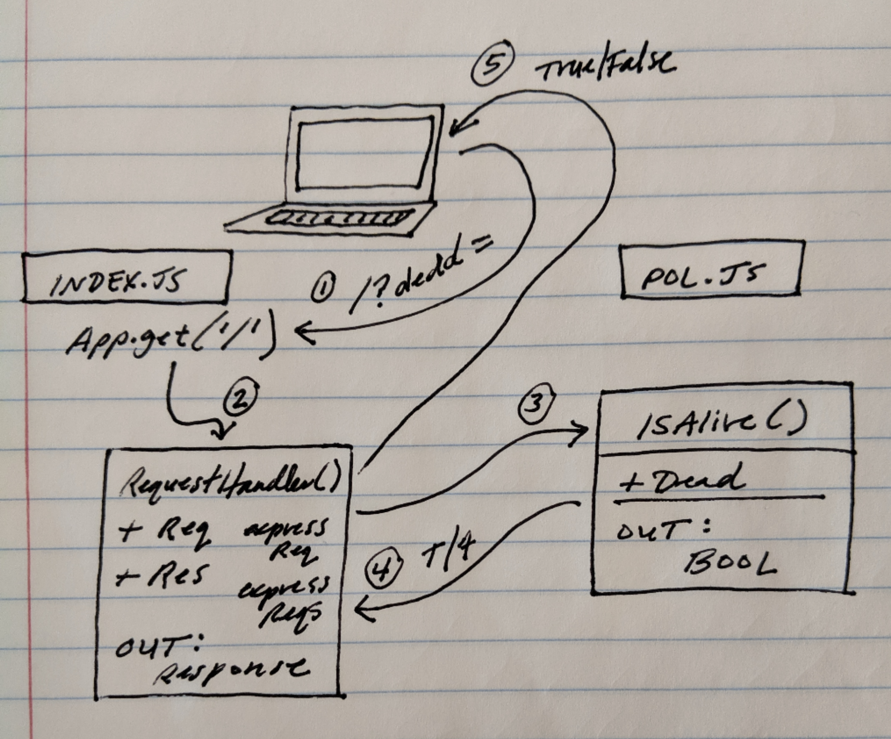

# LAB - 00

## Proof of Life Server

### Author: Alex Spencer

### Links and Resources
* [submission PR](https://github.com/alexspencer-401-advanced-javascript/lab-00/pull/1)
* [travis](https://travis-ci.com/alexspencer-401-advanced-javascript/lab-00)
* [front-end](https://alexspencer-lab-00.herokuapp.com/)

#### Documentation
* [jsdoc](https://alexspencer-lab-00.herokuapp.com/docs/)

### Setup
#### `.env` requirements
* `PORT` - Port Number

#### Running the app

**Describe what npm scripts do**
- `npm run start`
- Endpoint: `/`
    * Returns a boolean
- Endpoint: `/docs`
    * Returns JSDoc Documentation Pages
  
#### Tests
- Unit Tests: `npm test`
- Lint Tests: `npm run lint`

#### UML

